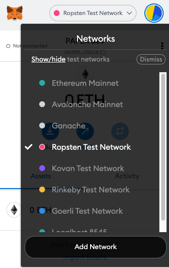

[![Issues][issues-shield]][issues-url]
[![Contributors][contributors-shield]][contributors-url]


<br />
<div align="center">
    <a href="https://github.com/mattg1243/paper">
    
    </a>
</div>
## Available npm Scripts

In the project directory, you can run:

`npm install`
`npm start`

Runs the app in the development mode.\
Open [http://localhost:3000](http://localhost:3000) to view it in the browser.

The page will reload if you make edits.\
You will also see any lint errors in the console.

`npm test`

Launches the test runner in the interactive watch mode.\
See the section about [running tests](https://facebook.github.io/create-react-app/docs/running-tests) for more information.

`npm run build`

Builds the app for production to the `build` folder.\
It correctly bundles React in production mode and optimizes the build for the best performance.

The build is minified and the filenames include the hashes.\
Your app is ready to be deployed!

See the section about [deployment](https://facebook.github.io/create-react-app/docs/deployment) for more information.

`npm run eject`

**Note: this is a one-way operation. Once you `eject`, you can’t go back!**

If you aren’t satisfied with the build tool and configuration choices, you can `eject` at any time. This command will remove the single build dependency from your project.

Instead, it will copy all the configuration files and the transitive dependencies (webpack, Babel, ESLint, etc) right into your project so you have full control over them. All of the commands except `eject` will still work, but they will point to the copied scripts so you can tweak them. At this point you’re on your own.

You don’t have to ever use `eject`. The curated feature set is suitable for small and middle deployments, and you shouldn’t feel obligated to use this feature. However we understand that this tool wouldn’t be useful if you couldn’t customize it when you are ready for it.

## Truffle
In the root directory, you can run:
 ```truffle compile```
 this will compile all contracts in the project into truffle_abis
 ```truffle test```
 this will compile all contracts and run tests described in test/paperCoin.test.js

 ### Using the Truffle console
 Example usage of the truffle console to interact with/debug contract instance.
```sh
    truffle console
    let paper = await Paper.deployed()
    let owner = await paper.owner()
```
With the first command we set 'paper' to the newly deployed contract instance. From there we can grab the contract's owner. Once we have the contract's owner we can test other functions like transfer, mint, and burn. 

### Connecting to Ropsten testnet with MetaMask
Since PAPER is an ERC-20 implementation, users will need a MetaMask wallet (or any HDWalletprovider) connected to Ropsten testnet to interact with the contract and sign transactions.
<div align="center">
    
</div>

### Getting testnet ether from a Ropsten faucet
Users can acquire Ropsten rETH from any Ropsten faucet. Simply provide the faucet with your address on Ropsten network and the faucet will pour you some test ether!

List of recomended faucets for Ropsten
[Ropsten Faucet](https://faucet.ropsten.be)
[Dimensions Network faucet](https://faucet.dimensions.network)


## Learn about $PAPER
It would be possible to create this application without having a native coin for transacting with, however, we felt it was in the spirit of crypto to create this mock coin. $PAPER is defined in it's simplicity in [Paper.sol](https://github.com/mattg1243/paper/blob/main/src/contracts/Paper.sol).

Paper makes use of this native coin to simulate trading in a crypto market. PAPER utilizes 2 decimal places to mimick the most common USD denom. PAPER can be thought of as a mock USDC in this program. Users can mint as many PAPER as they'd like to trade with, and they can burn PAPER whenever they want to decrease their buying power. This is accomplished by creating a simple smart contract that defines the PAPER coin and it's associated functions, and deploying that contract to Ropsten testnet. It would be cost ineffective to deploy on mainnet, since this is designed for paper trading. By keeping the contracts on Ropsten, required gas fees for transacting are paid in testnet Ether.


## $PAPER functions
For demonstration purposes, assume owner = '0x3010DC4824C238519D20A913BC1622d4901b0EC6'
### Balances
```sh
    paper.balanceOf(owner).toString()
```
The balanceOf function is a mapping of addresses to uint256 balances. It takes only one argument, the address of who's balance you'd like to check. Since it returns a mapping you need to convert it to a string to isolate the balance of the corresponding address.
### Mint
```sh
    paper.mint(owner, 1000)
```
Remember PAPER uses 2 decimal places to mimick common USD denoms. This command mints 10.00 PAPER and sends it to the owner address. This function emits a Mint event which will be viewable on-chain.
### Burn
```sh
    paper.burn(1000)
```
This command burns 10.00 PAPER from the balance of whoever calls the function. Notice that an address is not required as a function param. The burn function will automatically burn the amount specified for whoever the msg.sender is. This function emits a Burn event which will be viewable on-chain.

To learn more about PAPER, check out the [PAPER smart contract](https://github.com/mattg1243/paper/blob/main/src/contracts/Paper.sol).

[contributors-shield]: https://img.shields.io/github/contributors/mattg1243/paper.svg?style=for-the-badge
[contributors-url]: https://github.com/mattg1243/paper/graphs/contributors
[issues-shield]: https://img.shields.io/github/issues/ethgallucci/Mockingbird.svg?style=for-the-badge
[issues-url]: https://github.com/ethgallucci/Mockingbird/issues